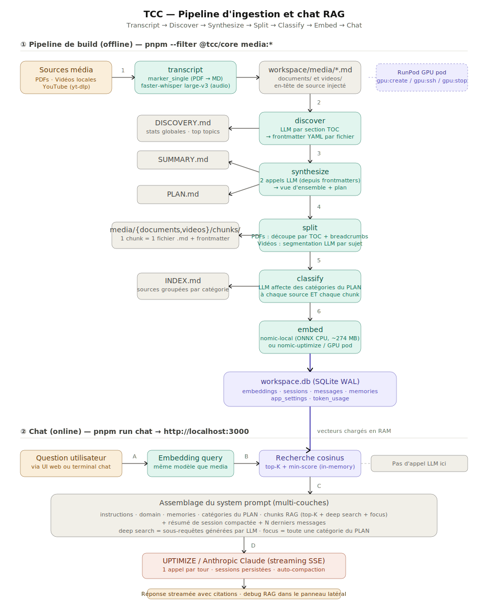

# TCC — Transcript, Classify & Chat

[English](./README.md) · **Français**

> Transformez une pile de PDFs et de vidéos en base de connaissances chercheable et chat-ready — avec une UI web locale propulsée par Claude.

**TCC** est un outil interne KTSO qui exécute un pipeline multi-étapes pour transcrire vos médias, les organiser dans une base structurée, les vectoriser, et servir un chat RAG sur le résultat. Tout sauf les appels LLM tourne **sur votre machine** : chunks, sessions, mémoires et index vectoriel vivent dans un fichier SQLite local.

Pressé ? → [**QUICKSTART.fr.md**](./QUICKSTART.fr.md)

---

## Pourquoi TCC

- **Un seul flux pour des médias mixtes** : PDFs, vidéos locales et URLs YouTube passent par le même pipeline et finissent en chunks chercheables.
- **Structuré, pas seulement découpé** : chaque source est *discoverée* (topics, qualité, résumé), classifiée selon un PLAN hiérarchique et indexée — le chat peut donc faire de la récupération *au niveau catégorie*, pas seulement de la similarité fuzzy.
- **Local d'abord** : index vectoriel, sessions de chat, mémoires et corrections Q&A restent dans `workspaces/<nom>/workspace.db`. Rien ne quitte votre laptop sauf l'appel LLM vers UPTIMIZE / Anthropic.
- **Workspaces partageables** : des bases nettoyées et zippées peuvent être passées à un collègue — il dézippe, fixe `WORKSPACE=…`, et lance `pnpm run chat`.
- **Reprenable et idempotent** : chaque commande du pipeline saute ce qui est déjà fait ; `--force` retraite tout, `--dry-run` prévisualise.

---

## Architecture



Deux moitiés :

1. **Pipeline de build (offline)** — exécuté une fois par workspace via `pnpm --filter @tcc/core media:*`. Produit un `workspace.db` entièrement classifié et vectorisé.
2. **Chat (online)** — `pnpm run chat` démarre l'API Hono + l'UI Vite. L'index vectoriel est chargé en mémoire, les requêtes sont embeddées avec le même modèle qu'au build, et Claude est appelé une fois par tour avec un system prompt multi-couches.

Le flux complet est décrit phase par phase ci-dessous.

---

## Le pipeline, phase par phase

### Phase 0 — Setup *(une fois, uniquement si vous voulez ingérer vos propres médias)*

```bash
pnpm --filter @tcc/core transcript:setup    # installe runpodctl, yt-dlp, ffmpeg en local
```

Vous avez aussi besoin d'un **pod GPU RunPod** pour la transcription (`marker_single` pour les PDFs, `faster-whisper` large-v3 pour l'audio). Le pod est éphémère et géré via les commandes `gpu:*` :

```bash
pnpm --filter @tcc/core gpu:create | gpu:status | gpu:ssh | gpu:start | gpu:stop | gpu:terminate
```

> Si vous voulez juste **utiliser** un workspace existant (par exemple `industrial-edge` ou `noa`), sautez les phases 0 à 6 et passez directement à la **Phase 7 — Chat**.

---

### Phase 1 — Transcript

```bash
pnpm --filter @tcc/core transcript              # documents + vidéos en un coup
pnpm --filter @tcc/core transcript:documents    # PDFs uniquement
pnpm --filter @tcc/core transcript:videos       # vidéos / URLs YouTube uniquement
```

- Les **PDFs** sont uploadés sur le pod GPU et convertis en Markdown via **marker_single** (OCR + mise en page assistée par LLM). Les espaces blancs excessifs des tableaux sont compactés pour réduire les tokens 5 à 10×.
- Les **vidéos** (fichiers locaux ou YouTube via `yt-dlp`) sont normalisées en MP3 mono 16 kHz et transcrites via **faster-whisper large-v3**.
- La sortie atterrit dans `workspaces/<nom>/media/documents/*.md` et `workspaces/<nom>/media/videos/*.md`, chaque fichier préfixé d'un en-tête `> Source / Pages / Duration / Language`.

---

### Phase 2 — Discover

```bash
pnpm --filter @tcc/core media:discover          # idempotent
pnpm --filter @tcc/core media:discover:force    # re-discover tout
```

Pour chaque fichier source, TCC parse son en-tête de métadonnées, détecte la langue (`franc-min`), découpe les longs documents par sections TOC et demande au LLM d'extraire `title / topics / quality / summary / suggested_category`. Les résultats sont fusionnés entre sections et **injectés en frontmatter YAML** en haut de chaque `.md`.

Un **`DISCOVERY.md`** global est écrit à la racine du workspace avec les statistiques agrégées (top topics, catégories suggérées, distribution de qualité).

---

### Phase 3 — Synthesize

```bash
pnpm --filter @tcc/core media:synthesize
```

Lit uniquement les frontmatters discoverés (sans contenu) et fait **deux appels LLM séparés** :

- **`SUMMARY.md`** — résumé exécutif de toute la base, thèmes, lacunes.
- **`PLAN.md`** — plan de catégories hiérarchique (`A. Section`, `A.1 Sous-section`, …) inféré depuis ce qui a été discoveré. Ce plan est la colonne vertébrale du **focus mode** au moment du chat.

---

### Phase 4 — Split

```bash
pnpm --filter @tcc/core media:split             # écrit les chunks
pnpm --filter @tcc/core media:split:dry         # preview seule
pnpm --filter @tcc/core media:split:check       # audit des breadcrumbs
pnpm --filter @tcc/core media:split:undo        # restaure les originaux
```

- Les **documents** sont découpés selon leur TOC (3 niveaux de profondeur). Chaque chunk reçoit un **breadcrumb** (`Partie II / Chapitre 3 / Section 5`) et les sections trop grosses sont sous-découpées aux frontières de paragraphes.
- Les **vidéos** sont envoyées au LLM pour une **segmentation par sujet** (5 à 20 segments par vidéo), chacun avec un titre et un court résumé.
- Les chunks sont écrits dans `media/{documents,videos}/chunks/*.md`, chacun avec son propre frontmatter (`source_origin`, `chunk_index`, `path`, `chars`, `tokens_approx`, …).

---

### Phase 5 — Classify

```bash
pnpm --filter @tcc/core media:classify          # idempotent
pnpm --filter @tcc/core media:classify:force    # re-classify tout
pnpm --filter @tcc/core media:classify:check    # audit de couverture
```

Deux passes contre le LLM, toutes deux pilotées par `PLAN.md` :

1. **Classification des sources** — assigne une ou plusieurs catégories du PLAN à chaque frontmatter source.
2. **Classification des chunks** — assigne des catégories au niveau chunk en utilisant le contenu du chunk + son breadcrumb, *et* hérite des catégories de la source parente.

Génère **`INDEX.md`** — chaque source listée sous sa catégorie, avec des indicateurs de qualité (🟢 / 🟡 / 🔴).

> **Pourquoi `split → classify` et pas l'inverse ?** Un même chunk peut appartenir à plusieurs catégories (ex : une section "Setup MQTT" dans un doc plus large "Networking" relève à la fois de *Protocoles/MQTT* et de *Réseau/Topologie*). La classification doit *voir les chunks finaux* pour assigner les catégories chunk par chunk — d'où l'ordre split d'abord.

---

### Phase 6 — Embed

```bash
pnpm --filter @tcc/core media:embed             # idempotent — saute les chunks déjà embeddés
pnpm --filter @tcc/core media:embed:force       # re-embed tout
pnpm --filter @tcc/core media:embed:gpu         # exécute end-to-end sur un pod GPU RunPod
pnpm --filter @tcc/core media:embed:bench       # benchmark des engines sur un set de queries
pnpm --filter @tcc/core media:embed:import      # importe des vecteurs depuis un autre workspace.db
pnpm --filter @tcc/core media:embed:stats       # stats par modèle / DTYPE
```

Trois engines sont supportés (factory dans `packages/core/src/common/embed/`) :

| Engine            | Où ça tourne                   | Notes                                              |
|-------------------|--------------------------------|----------------------------------------------------|
| `nomic-local`     | ONNX CPU sur votre machine     | Par défaut. Modèle ~274 MB téléchargé au 1er run   |
| `nomic-uptimize`  | API UPTIMIZE                   | Pas de modèle local, requiert des credentials API  |
| `jina-local`      | ONNX CPU sur votre machine     | Modèle local alternatif                            |

Le DTYPE (`fp16`, `int8`, …) est stocké dans le nom du modèle en DB pour que plusieurs quantizations puissent coexister. Les vecteurs atterrissent dans `workspace.db` (SQLite + WAL).

> **Astuce Windows — empêcher la mise en veille pendant les longs runs.** L'embedding (et dans une moindre mesure `classify`) peut prendre plusieurs heures sur un gros workspace. Si la machine s'endort ou que l'économiseur d'écran se déclenche, le run peut se figer. Depuis un terminal PowerShell séparé, lancez :
> ```powershell
> powershell -ExecutionPolicy Bypass -File tools/keep-awake.ps1
> ```
> Le script envoie une touche `F15` (inoffensive) toutes les 60 secondes pour garder la session active. `Ctrl+C` pour stopper.

---

### Phase 7 — Chat 🎉

Depuis la **racine du repo** (pas depuis `packages/core/`) :

```bash
pnpm run chat
```

Démarre les deux serveurs en parallèle :

- **API Hono** sur `http://localhost:3001` — récupération RAG + streaming Claude
- **Client Vite** sur `http://localhost:3000` — à ouvrir dans votre navigateur

Ce que fait le chat à chaque tour :

1. Embedde votre question avec le *même* modèle que celui utilisé pour construire le workspace.
2. Lance une **recherche cosinus top-K** sur l'index vectoriel en mémoire (par défaut `K=20`, configurable, avec filtre de score minimum).
3. (Optionnel) **Deep search** — un petit appel LLM génère 3 à 5 sous-requêtes, chacune est embeddée et cherchée, les résultats sont fusionnés et dédupliqués. Activable depuis l'UI.
4. (Optionnel) **Focus mode** — choisissez une catégorie du `PLAN.md` et le retriever renvoie *tous* les chunks classifiés sous cette catégorie (ignore la similarité).
5. Assemble un system prompt multi-couches : `instructions → domain → memories → en-têtes du PLAN → chunks RAG → résumé de session → derniers messages`.
6. Appelle Claude (proxy UPTIMIZE ou Anthropic direct) avec **une seule** requête par tour, streamée en SSE.
7. Persiste le message, met à jour l'usage de tokens de la session, et auto-compacte les anciens tours quand l'historique dépasse `CHAT_COMPACTION_THRESHOLD_TOKENS`.

Un chat purement terminal est aussi disponible :

```bash
pnpm --filter @tcc/core chat
```

---

## Structure du repo

```
tcc/
├─ packages/
│  ├─ core/                 @tcc/core — CLI (25+ commandes)
│  │  └─ src/
│  │     ├─ commands/       un fichier par commande CLI
│  │     ├─ common/         db, llm, rag, embed/, prompts, history, media…
│  │     ├─ scripts/        scripts de maintenance one-off
│  │     ├─ cli.ts          registre des commandes
│  │     ├─ config.ts       charge .env depuis la racine du monorepo
│  │     └─ runpod*.ts      automatisation des pods GPU
│  └─ web/                  @tcc/web — API Hono + React 19 + Vite
│     ├─ server/            index.ts, sessions.ts, workspace*.ts
│     └─ src/               App.tsx, Chat.tsx, Sidebar.tsx, …
├─ templates/context/       templates de prompts par étape du pipeline
│  ├─ discover/  synthesize/  classify/  split/  chat/  shared/
├─ workspaces/              bases de connaissances isolées
│  ├─ noa/                  NAMUR Open Architecture (sample)
│  └─ industrial-edge/      Siemens Industrial Edge (sample)
├─ .env.quickstart          template d'env de démarrage — copier en .env
├─ architecture.svg         le diagramme ci-dessus (EN)
├─ architecture.fr.svg      le diagramme ci-dessus (FR)
├─ CLAUDE.md                guide pour Claude Code dans ce repo
├─ QUICKSTART.md            onboarding 5 minutes (EN)
├─ QUICKSTART.fr.md         onboarding 5 minutes (FR)
└─ README.md / README.fr.md ce fichier
```

Un **workspace** est auto-contenu. Chacun a :

```
workspaces/<nom>/
├─ media/
│  ├─ documents/            PDFs transcrits (.md)
│  │  └─ chunks/            chunks split
│  └─ videos/               vidéos transcrites (.md)
│     └─ chunks/            chunks split
├─ context/                 (optionnel) overrides de prompts par workspace
├─ workspace.json           métadonnées du workspace
├─ workspace.db             SQLite — embeddings + sessions + memories + …
├─ DISCOVERY.md             sortie de la phase 2
├─ SUMMARY.md               sortie de la phase 3
├─ PLAN.md                  sortie de la phase 3 (la colonne vertébrale catégorielle)
└─ INDEX.md                 sortie de la phase 5
```

---

## Configuration

Toute la configuration est chargée depuis un seul `.env` à la racine du repo. `config.ts` remonte depuis n'importe quel package jusqu'à trouver `pnpm-workspace.yaml`, donc les commandes marchent depuis n'importe où dans le monorepo.

Démarrez depuis le template :

```bash
cp .env.quickstart .env     # ou `copy` sous Windows
```

Variables clés :

| Variable           | Rôle                                                          |
|--------------------|---------------------------------------------------------------|
| `WORKSPACES_DIR`   | Dossier contenant tous les workspaces (défaut : `workspaces`) |
| `WORKSPACE`        | Nom du workspace actif (overridable via `--workspace=<nom>`)  |
| `API_PROVIDER`     | `uptimize` ou `anthropic`                                     |
| `API_KEY`          | Clé du proxy UPTIMIZE ou `sk-ant-…`                           |
| `API_MODEL`        | par ex. `eu.anthropic.claude-sonnet-4-6`                      |
| `MEDIA_EMBED_*`    | Engine + DTYPE pour le corpus media                           |
| `CHAT_*`           | Tuning du chat : top-K, min-score, deep search, compaction…  |

Le chat et le pipeline media peuvent utiliser des **configs LLM et embedding indépendantes** via une chaîne de fallback — voir `.env.example` pour la liste complète :

- `CHAT_API_*` → `API_*`
- `CHAT_EMBED_*` → `MEDIA_EMBED_*`
- `MEDIA_EMBED_API_*` → `API_*`

> **Sélection de workspace via les filtres pnpm** : pour overrider `WORKSPACE` via `--workspace=<nom>`, n'oubliez pas le séparateur `--` pour que pnpm transmette l'argument :
> `pnpm --filter @tcc/core media:embed -- --workspace=industrial-edge`

---

## Partager un workspace

```bash
pnpm --filter @tcc/core workspace:clean -- --workspace=<nom> --with-qa  # supprime sessions, mémoires, QA, embeddings
pnpm --filter @tcc/core workspace:zip   -- --workspace=<nom>            # zip slim (sans média brut)
pnpm --filter @tcc/core workspace:zip   -- --workspace=<nom> --full     # inclut le média brut
```

Le destinataire dézippe dans `workspaces/`, met `WORKSPACE=<nom>` dans son `.env`, et lance `pnpm run chat`.

---

## Prérequis

- **Node ≥ 20** (épinglé via `engines` dans le `package.json` racine)
- **pnpm 10.33.0** (épinglé via `packageManager`)
- Le premier `pnpm install` builde des modules natifs : `better-sqlite3`, `onnxruntime-node`, `sharp` (approbation requise, listés dans `pnpm.onlyBuiltDependencies`)
- Une clé API LLM valide (proxy UPTIMIZE ou Anthropic direct)
- **Pour l'ingestion uniquement** : un compte RunPod + `runpodctl`, `yt-dlp`, `ffmpeg` installés par `transcript:setup`

Il n'y a **pas de suite de tests, linter ou formatter** configurés dans ce repo. TypeScript tourne directement via `tsx` — pas de build step pour `@tcc/core`.

---

## Références

- [**QUICKSTART.fr.md**](./QUICKSTART.fr.md) · [QUICKSTART (EN)](./QUICKSTART.md) — setup en 5 minutes avec un workspace pré-construit
- [**README (EN)**](./README.md) — English version of this document
- [**CLAUDE.md**](./CLAUDE.md) — guide pour les instances Claude Code travaillant dans ce repo
- `.env.quickstart` — template d'env minimal
- `.env.example` — référence complète de toutes les options
- `workspaces/noa/README.md`, `workspaces/industrial-edge/README.md` — workspaces d'exemple

## Confidentialité

Les sessions de chat, mémoires, corrections Q&A et l'index vectoriel vivent **uniquement** dans `workspaces/<nom>/workspace.db` sur votre machine. Les seuls appels réseau que TCC fait sont :

- Les requêtes LLM (proxy UPTIMIZE ou API Anthropic)
- Les requêtes d'embedding *si* vous choisissez `nomic-uptimize`
- La transcription sur un pod GPU RunPod (uniquement pendant `transcript`)

## Questions ?

Pingez Vincent ou ouvrez une issue sur le repo interne.
