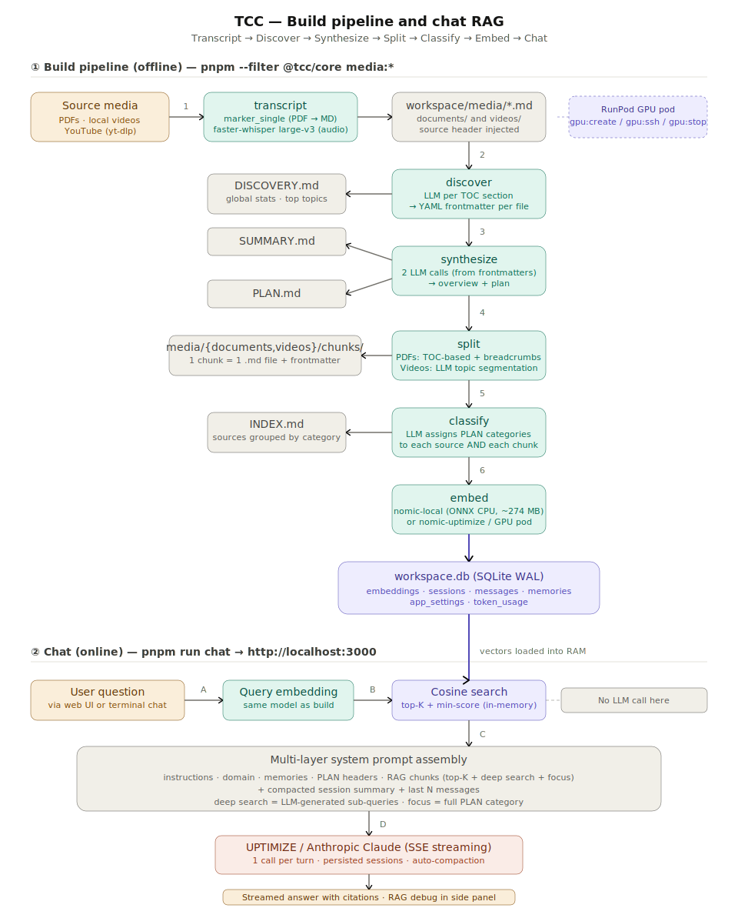

# TCC — Transcript, Classify & Chat

**English** · [Français](./README.fr.md)

> Turn a pile of PDFs and videos into a searchable, chat-ready knowledge base — with a local web UI powered by Claude.

**TCC** is an internal KTSO tool that runs a multi-stage pipeline to transcribe media, organize it into a structured knowledge base, embed it as vectors, and serve a RAG-powered chat over the result. Everything except the LLM calls runs **on your machine**: chunks, sessions, memories, and the vector index all live in a local SQLite file.

In a hurry? → [**QUICKSTART.md**](./QUICKSTART.md)

---

## Why TCC

- **One workflow for mixed media**: PDFs, local videos, and YouTube URLs all flow through the same pipeline and end up as searchable chunks.
- **Structured, not just chunked**: every source gets discovered (topics, quality, summary), classified into a hierarchical PLAN, and indexed — so the chat can do *category-level* retrieval, not only fuzzy similarity.
- **Local-first**: vector index, chat sessions, memories and Q&A edits stay in `workspaces/<name>/workspace.db`. Nothing leaves your laptop except the LLM call to UPTIMIZE / Anthropic.
- **Sharable workspaces**: cleaned, zipped knowledge bases can be handed off to colleagues — they unzip, set `WORKSPACE=…`, and run `pnpm run chat`.
- **Resumable & idempotent**: every pipeline command skips work that's already done; `--force` re-processes, `--dry-run` previews.

---

## Architecture



Two halves:

1. **Build pipeline (offline)** — runs once per workspace via `pnpm --filter @tcc/core media:*`. Produces a fully classified, embedded `workspace.db`.
2. **Chat (online)** — `pnpm run chat` starts the Hono API + Vite UI. The vector index is loaded into memory, queries are embedded with the same model used at build time, and Claude is called once per turn with a multi-layer system prompt.

The full data flow is described phase-by-phase below.

---

## The pipeline, phase by phase

### Phase 0 — Setup *(one-off, only if you want to ingest your own media)*

```bash
pnpm --filter @tcc/core transcript:setup    # installs runpodctl, yt-dlp, ffmpeg locally
```

You also need a **RunPod GPU pod** for transcription (`marker_single` for PDFs, `faster-whisper` large-v3 for audio). The pod is short-lived and managed via the `gpu:*` commands:

```bash
pnpm --filter @tcc/core gpu:create | gpu:status | gpu:ssh | gpu:start | gpu:stop | gpu:terminate
```

> If you only want to **use** an existing workspace (e.g. `industrial-edge` or `noa`), skip phases 0–6 entirely and jump straight to **Phase 7 — Chat**.

---

### Phase 1 — Transcript

```bash
pnpm --filter @tcc/core transcript              # documents + videos in one go
pnpm --filter @tcc/core transcript:documents    # PDFs only
pnpm --filter @tcc/core transcript:videos       # videos / YouTube URLs only
```

- **PDFs** are uploaded to the GPU pod and converted to Markdown with **marker_single** (OCR + LLM-assisted layout). Excessive table whitespace is compacted to cut tokens 5–10×.
- **Videos** (local files or YouTube via `yt-dlp`) are normalized to mono 16 kHz MP3 and transcribed with **faster-whisper large-v3**.
- Output lands in `workspaces/<name>/media/documents/*.md` and `workspaces/<name>/media/videos/*.md`, each prefixed with a `> Source / Pages / Duration / Language` header.

---

### Phase 2 — Discover

```bash
pnpm --filter @tcc/core media:discover          # idempotent
pnpm --filter @tcc/core media:discover:force    # re-discover everything
```

For each source file, TCC parses its metadata header, detects the language (`franc-min`), splits long documents along TOC sections, and asks the LLM to extract `title / topics / quality / summary / suggested_category`. Results are merged across sections and **injected as YAML frontmatter** at the top of each `.md`.

A global **`DISCOVERY.md`** is written at the workspace root with aggregated statistics (top topics, suggested categories, quality distribution).

---

### Phase 3 — Synthesize

```bash
pnpm --filter @tcc/core media:synthesize
```

Reads only the discovered frontmatters (no body content) and makes **two separate LLM calls**:

- **`SUMMARY.md`** — executive summary of the whole knowledge base, themes, gaps.
- **`PLAN.md`** — hierarchical category plan (`A. Section`, `A.1 Sub-section`, …) inferred from what was discovered. This plan is the backbone of the chat-time **focus mode**.

---

### Phase 4 — Split

```bash
pnpm --filter @tcc/core media:split             # writes chunks
pnpm --filter @tcc/core media:split:dry         # preview only
pnpm --filter @tcc/core media:split:check       # audit breadcrumbs
pnpm --filter @tcc/core media:split:undo        # restore originals
```

- **Documents** are split along their TOC (3 levels deep). Each chunk gets a **breadcrumb path** (`Part II / Chapter 3 / Section 5`) and oversized sections are sub-split at paragraph boundaries.
- **Videos** are sent to the LLM for **topic segmentation** (5–20 segments per video), each with a title and a short summary.
- Chunks are written to `media/{documents,videos}/chunks/*.md`, each with its own frontmatter (`source_origin`, `chunk_index`, `path`, `chars`, `tokens_approx`, …).

---

### Phase 5 — Classify

```bash
pnpm --filter @tcc/core media:classify          # idempotent
pnpm --filter @tcc/core media:classify:force    # re-classify everything
pnpm --filter @tcc/core media:classify:check    # audit category coverage
```

Two passes against the LLM, both driven by `PLAN.md`:

1. **Source classification** — assigns one or more PLAN categories to every source frontmatter.
2. **Chunk classification** — assigns chunk-level categories using the chunk content + breadcrumb context, *and* inherits the parent source's categories.

Generates **`INDEX.md`** — every source listed under its category, with quality indicators (🟢 / 🟡 / 🔴).

> **Why `split → classify` and not the other way around?** A single chunk can belong to multiple categories (e.g. a "MQTT setup" section in a broader "Networking" doc fits both *Protocols/MQTT* and *Network/Topology*). Classification has to *see the final chunks* to assign per-chunk categories — hence split must come first.

---

### Phase 6 — Embed

```bash
pnpm --filter @tcc/core media:embed             # idempotent — skips already-embedded chunks
pnpm --filter @tcc/core media:embed:force       # re-embed everything
pnpm --filter @tcc/core media:embed:gpu         # run end-to-end on a RunPod GPU pod
pnpm --filter @tcc/core media:embed:bench       # benchmark engines on a query set
pnpm --filter @tcc/core media:embed:import      # import vectors from another workspace.db
pnpm --filter @tcc/core media:embed:stats       # stats per model / DTYPE
```

Three engines are supported (factory in `packages/core/src/common/embed/`):

| Engine            | Where it runs                  | Notes                                          |
|-------------------|--------------------------------|------------------------------------------------|
| `nomic-local`     | ONNX CPU on your machine       | Default. ~274 MB model downloaded on first run |
| `nomic-uptimize`  | UPTIMIZE API                   | No local model, requires API credentials      |
| `jina-local`      | ONNX CPU on your machine       | Alternative local model                        |

The DTYPE (`fp16`, `int8`, …) is stored in the model name in DB so multiple quantizations can coexist. Vectors land in `workspace.db` (SQLite + WAL).

> **Windows tip — keep the machine awake during long runs.** Embedding (and to a lesser extent `classify`) can take several hours on a large workspace. If your machine sleeps or the screensaver kicks in, the run can stall. From a separate PowerShell terminal, run:
> ```powershell
> powershell -ExecutionPolicy Bypass -File tools/keep-awake.ps1
> ```
> It sends a harmless `F15` keystroke every 60 seconds to keep the session active. `Ctrl+C` to stop.

---

### Phase 7 — Chat 🎉

From the **repo root** (not from `packages/core/`):

```bash
pnpm run chat
```

This starts both servers concurrently:

- **Hono API** on `http://localhost:3001` — RAG retrieval + Claude streaming
- **Vite client** on `http://localhost:3000` — open this in your browser

What the chat does at every turn:

1. Embeds your question with the *same* model used to build the workspace.
2. Runs **top-K cosine search** over the in-memory vector index (default `K=20`, configurable, score threshold filtered).
3. (Optional) **Deep search** — a small LLM call generates 3–5 sub-queries, each is embedded and searched, results are merged and deduplicated. Toggleable in the UI.
4. (Optional) **Focus mode** — pick a category from `PLAN.md` and the retriever returns *all* chunks classified under that category (ignores similarity).
5. Assembles a multi-layer system prompt: `instructions → domain → memories → PLAN headers → RAG chunks → session summary → recent messages`.
6. Calls Claude (UPTIMIZE proxy or Anthropic direct) with **one** request per turn, streamed via SSE.
7. Persists the message, updates session token usage, and auto-compacts old turns when the history exceeds `CHAT_COMPACTION_THRESHOLD_TOKENS`.

A terminal-only chat is available too:

```bash
pnpm --filter @tcc/core chat
```

---

## Repo layout

```
tcc/
├─ packages/
│  ├─ core/                 @tcc/core — CLI (25+ commands)
│  │  └─ src/
│  │     ├─ commands/       one file per CLI command
│  │     ├─ common/         db, llm, rag, embed/, prompts, history, media…
│  │     ├─ scripts/        one-off maintenance scripts
│  │     ├─ cli.ts          command registry
│  │     ├─ config.ts       loads .env from monorepo root
│  │     └─ runpod*.ts      GPU pod automation
│  └─ web/                  @tcc/web — Hono API + React 19 + Vite
│     ├─ server/            index.ts, sessions.ts, workspace*.ts
│     └─ src/               App.tsx, Chat.tsx, Sidebar.tsx, …
├─ templates/context/       prompt templates per pipeline stage
│  ├─ discover/  synthesize/  classify/  split/  chat/  shared/
├─ workspaces/              isolated knowledge bases
│  ├─ noa/                  NAMUR Open Architecture (sample)
│  └─ industrial-edge/      Siemens Industrial Edge (sample)
├─ .env.quickstart          starter env file — copy to .env
├─ architecture.svg         the diagram above
├─ CLAUDE.md                guidance for Claude Code in this repo
├─ QUICKSTART.md            5-minute onboarding
└─ README.md                this file
```

A **workspace** is self-contained. Each one has:

```
workspaces/<name>/
├─ media/
│  ├─ documents/            transcribed PDFs (.md)
│  │  └─ chunks/            split chunks
│  └─ videos/               transcribed videos (.md)
│     └─ chunks/            split chunks
├─ context/                 (optional) per-workspace prompt overrides
├─ workspace.json           workspace metadata
├─ workspace.db             SQLite — embeddings + sessions + memories + …
├─ DISCOVERY.md             phase 2 output
├─ SUMMARY.md               phase 3 output
├─ PLAN.md                  phase 3 output (the category backbone)
└─ INDEX.md                 phase 5 output
```

---

## Configuration

All config is loaded from a single `.env` at the repo root. `config.ts` walks up from any package until it finds `pnpm-workspace.yaml`, so commands work from anywhere in the monorepo.

Start from the template:

```bash
cp .env.quickstart .env     # or `copy` on Windows
```

Key variables:

| Variable           | Purpose                                                       |
|--------------------|---------------------------------------------------------------|
| `WORKSPACES_DIR`   | Directory containing all workspaces (default: `workspaces`)   |
| `WORKSPACE`        | Active workspace name (overridable via `--workspace=<name>`)  |
| `API_PROVIDER`     | `uptimize` or `anthropic`                                     |
| `API_KEY`          | UPTIMIZE proxy key or `sk-ant-…`                              |
| `API_MODEL`        | e.g. `eu.anthropic.claude-sonnet-4-6`                         |
| `MEDIA_EMBED_*`    | Engine + DTYPE for the media corpus                           |
| `CHAT_*`           | Chat tuning: top-K, min-score, deep search, compaction…       |

The chat and the media pipeline can use **independent LLM and embedding configs** via a fallback chain — see `.env.example` for the complete list:

- `CHAT_API_*` → `API_*`
- `CHAT_EMBED_*` → `MEDIA_EMBED_*`
- `MEDIA_EMBED_API_*` → `API_*`

> **Workspace selection through pnpm filters**: when overriding `WORKSPACE` via `--workspace=<name>`, remember the `--` separator so pnpm forwards the argument:
> `pnpm --filter @tcc/core media:embed -- --workspace=industrial-edge`

---

## Sharing a workspace

```bash
pnpm --filter @tcc/core workspace:clean -- --workspace=<name> --with-qa  # strip sessions, memories, QA edits, embeddings
pnpm --filter @tcc/core workspace:zip   -- --workspace=<name>            # slim zip (no raw media)
pnpm --filter @tcc/core workspace:zip   -- --workspace=<name> --full     # include raw media
```

The receiver unzips into `workspaces/`, sets `WORKSPACE=<name>` in `.env`, and runs `pnpm run chat`.

---

## Prerequisites

- **Node ≥ 20** (pinned via root `package.json` `engines`)
- **pnpm 10.33.0** (pinned via `packageManager`)
- First `pnpm install` will build native modules: `better-sqlite3`, `onnxruntime-node`, `sharp` (approval required, listed in `pnpm.onlyBuiltDependencies`)
- A valid LLM API key (UPTIMIZE proxy or Anthropic direct)
- **For ingestion only**: a RunPod account + `runpodctl`, `yt-dlp`, `ffmpeg` installed by `transcript:setup`

There is **no test suite, linter, or formatter** configured in this repo. TypeScript runs directly via `tsx` — no build step for `@tcc/core`.

---

## Reference

- [**QUICKSTART.md**](./QUICKSTART.md) · [QUICKSTART (FR)](./QUICKSTART.fr.md) — 5-minute setup using a pre-built workspace
- [**README (FR)**](./README.fr.md) — version française de ce document
- [**CLAUDE.md**](./CLAUDE.md) — guidance for Claude Code instances working in this repo
- `.env.quickstart` — minimal env template
- `.env.example` — full reference of all tunable options
- `workspaces/noa/README.md`, `workspaces/industrial-edge/README.md` — sample workspaces

## Privacy

Chat sessions, memories, Q&A edits, and the vector index live **only** in `workspaces/<name>/workspace.db` on your machine. The only network calls TCC makes are:

- LLM requests (UPTIMIZE proxy or Anthropic API)
- Embedding requests *if* you choose `nomic-uptimize`
- Transcription on a RunPod GPU pod (only during `transcript`)

## Questions?

Ping Vincent or open an issue on the internal repo.
